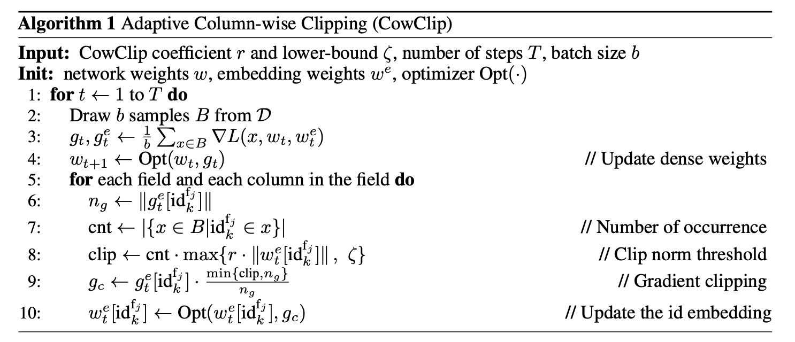

# Large Batch Training for CTR Prediction (CowClip)

LargeBatchCTR aims to train CTR prediction models with large batch (~128k). The framework is based on [DeepCTR](https://github.com/shenweichen/DeepCTR). You can run the code on a V100 GPU to feel the fast training speed.

Adaptive Column-wise Clipping (CowClip) method from paper "CowClip: Reducing CTR Prediction Model Training
Time from 12 hours to 10 minutes on 1 GPU" is implemented in this repo.

## Get Started

First, download dataset to the data folder. Use `data_utils.py` to preprocess the data for training.

```sh
python data_utils --dataset criteo_kaggle --split rand
```

Then, use `train.py` to train the network.

```sh
# Criteo (baseline)
CUDA_VISIBLE_DEVICES=0 python train.py --dataset criteo_kaggle --model DeepFM
# Avazu (baseline)
CUDA_VISIBLE_DEVICES=0 python train.py --dataset avazu --model DeepFM
```

For large batch training with CowClip, do as follows:

```sh
# Criteo (8K)
CUDA_VISIBLE_DEVICES=0 python train.py --dataset criteo_kaggle --model DeepFM --lr_embed 1e-4 --warmup 1 --init_stddev 1e-2 --clip 1 --bound 1e-5 --bs 8192 --l2 8e-05 --lr 22.6274e-4
# Criteo (128K)
CUDA_VISIBLE_DEVICES=0 python train.py --dataset criteo_kaggle --model DeepFM --lr_embed 1e-4 --warmup 1 --init_stddev 1e-2 --clip 1 --bound 1e-5 --bs 131072 --l2 128e-05 --lr 90.5096e-4
# Avazu (64K)
CUDA_VISIBLE_DEVICES=0 python train.py --dataset avazu --model DeepFM --lr_embed 1e-4 --warmup 1 --init_stddev 1e-2 --clip 1 --bound 1e-4 --bs 65536 --l2 64e-05 --lr 8e-4
```

## CowClip Quick Look



## Dataset List

- [Criteo Kaggle](https://labs.criteo.com/2014/02/kaggle-display-advertising-challenge-dataset): download `train.txt` in `data/criteo_kaggle/`
- [Avazu](https://www.kaggle.com/c/avazu-ctr-prediction): download `train` in `data/avazu/`

## Hyperparameters

The meaning of hyperparameters in the command line is as follows:

| params        | name                                        |
| ------------- | ------------------------------------------- |
| --bs          | batch size                                  |
| --lr_embed    | learning rate for the embedding layer       |
| --lr          | learning rate for the dense weights         |
| --l2          | L2-regularization weight λ                  |
| --clip        | CowClip coefficient r                       |
| --bound       | CowClip bound ζ                             |
| --warmup      | number of epochs to warmup on dense weights |
| --init_stddev | initialization weight standard deviation    |

The hyperparameters neet to be scaled are listed as follows. For Criteo dataset:

| bs   | lr       | l2     |   ζ   | DeepFM AUC(%) | Time(min) |
| :--- | :------- | :----- | :---: | :-----------: | :-------: |
| 1K   | 8e-4     | 1e-4   | 1e-5  |     80.86     |    768    |
| 2K   | 11.31e-4 | 2e-4   | 1e-5  |     80.93     |    390    |
| 4K   | 16e-4    | 4e-4   | 1e-5  |     80.97     |    204    |
| 8K   | 22.62e-4 | 8e-4   | 1e-5  |     80.97     |    102    |
| 16K  | 32e-4    | 16e-4  | 1e-5  |     80.94     |    48     |
| 32K  | 45.25e-4 | 32e-4  | 1e-5  |     80.95     |    27     |
| 64K  | 64e-4    | 64e-4  | 1e-5  |     80.96     |    15     |
| 128K | 90.50e-4 | 128e-4 | 1e-5  |     80.90     |     9     |

For Avazu dataset:

| bs   | lr      | l2    |   ζ   | DeepFM AUC(%) | Time(min) |
| :--- | :------ | :---- | :---: | :-----------: | :-------: |
| 1K   | 1e-4    | 1e-4  | 1e-3  |     78.83     |    210    |
| 2K   | 1.41e-4 | 2e-4  | 1e-3  |     78.82     |    108    |
| 4K   | 2e-4    | 4e-4  | 1e-4  |     78.90     |    54     |
| 8K   | 2.83e-4 | 8e-4  | 1e-4  |     79.06     |    30     |
| 16K  | 4e-4    | 16e-4 | 1e-4  |     79.01     |    17     |
| 32K  | 5.66e-4 | 32e-4 | 1e-4  |     78.82     |    10     |
| 64K  | 8e-4    | 64e-4 | 1e-4  |     78.82     |    6.7    |
| 128K | 16e-4   | 96e-4 | 1e-4  |     78.80     |    4.8    |

## Model List

|        Model         | Paper                                                                                                                                              |
| :------------------: | :------------------------------------------------------------------------------------------------------------------------------------------------- |
|     Wide & Deep      | [DLRS 2016][Wide & Deep Learning for Recommender Systems](https://arxiv.org/pdf/1606.07792.pdf)                                                    |
|        DeepFM        | [IJCAI 2017][DeepFM: A Factorization-Machine based Neural Network for CTR Prediction](http://www.ijcai.org/proceedings/2017/0239.pdf)              |
| Deep & Cross Network | [ADKDD 2017][Deep & Cross Network for Ad Click Predictions](https://arxiv.org/abs/1708.05123)                                                      |
|        DCN V2        | [arxiv 2020][DCN V2: Improved Deep & Cross Network and Practical Lessons for Web-scale Learning to Rank Systems](https://arxiv.org/abs/2008.13535) |

## Requirements

Tensorflow 2.4.0  
Tensorflow-Addons

```sh
pip install -r requirements.txt
```

## Citation

```bibtex
@article{zheng2022cowclip,
  title={{CowClip}: Reducing {CTR} Prediction Model Training Time from 12 hours to 10 minutes on 1 {GPU}},
  author={Zangwei Zheng, Pengtai Xu, Xuan Zou, Da Tang, Zhen Li, Chenguang Xi, Peng Wu, Leqi Zou, Yijie Zhu, Ming Chen, Xiangzhuo Ding, Fuzhao Xue, Ziheng Qing, Youlong Cheng, Yang You},
  journal={arXiv},
  volume={abs/2204.06240},
  year={2022}
}
```
